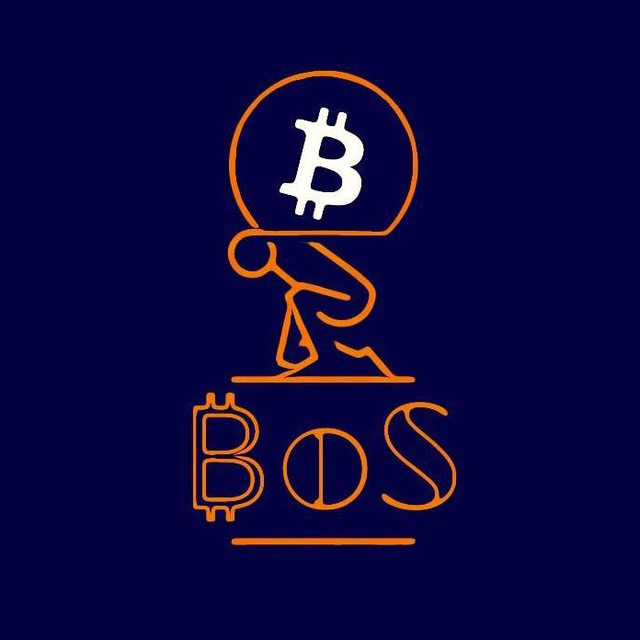
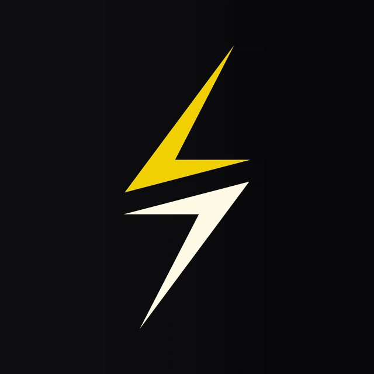
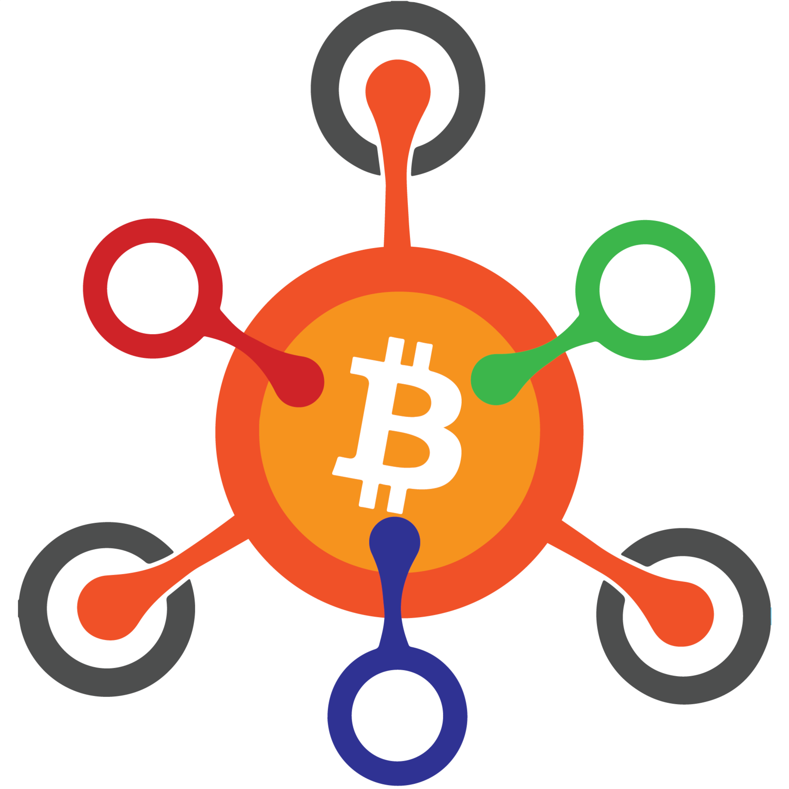
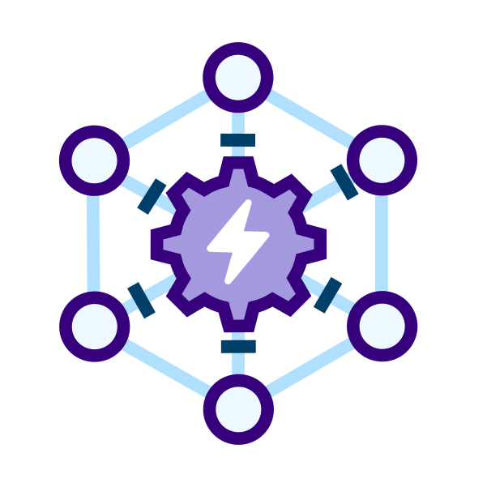
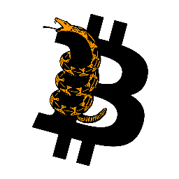
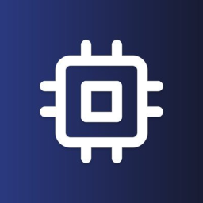

# Awesome Bitcoin Logos

A collection of Bitcoin and Lightning Network FOSS program logos.

### Use case example

Create and personalize a Homer homepage with logos for all your Bitcoin self-hosted web services:
* [Homer install guide on the RaspiBolt](https://raspibolt.org/bonus/raspberry-pi/homer.md)
* [Logos of self-hosted web services only](#self-hosted-web-services-only)

---

## All

                                             

---

## Self-hosted web services only

             
